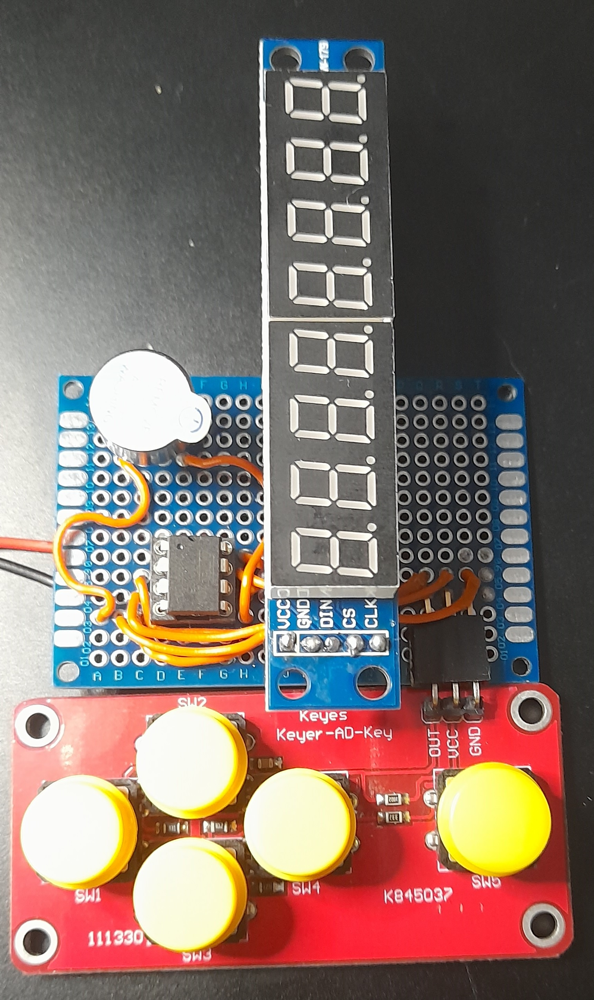

# minimalist_game_console

A minimilast game console with an attiny85, a 5 buttons ad keyboard, a 8x7 segments red led (with max7219 controller) and a buzzer (optional).

I made it to simulate a game I had when I was young : "battlestar galactica - space alert" , from Mattel (just like I remember it, not as it really was)

The first prototype : https://youtu.be/K5pQh2IcPR4

The final prototype : https://youtu.be/7Ir9gm09HzU

You can take a look a the wiring(x).jpg pictures to have an idea of how to connect the parts :

For the 8*7 led segment :

DIN -> PB1

CS -> PB3

CLK -> PB4

Keyboard out -> A1/PB2

Buzzer  + -> PB0

How to play:

The game starts automatically (the high score is displayed for 2 seconds, taken from the eeprom)

Push the button 1 to 4 to move the missile

Push button 5 to shoot

You have 5 lives (==)(four dashes representing the shields, disapearing when shot, and one last chance when the 4 are lost)  at the botton and the missile is the '|' that moves.

Aliens are going from top to bottom and each time an alien reaches bottom you lose a life/shield.

Up to 3 aliens can  go down.

We can imagine other games , when and if I make other games, I'll post them.
If some other people make games with it, let me know
